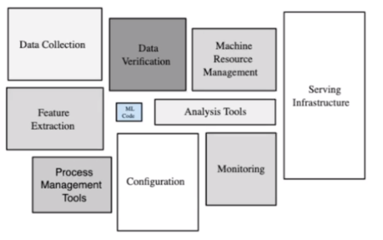

## Teacher: Olof Harrysson.
- Will try to follow in Kokchuns footsteps.
- Project will start next week, Groups will be released later today through Discord.

  
Has worked with python, computer vision. ML Programmer at Modulai, small consultancy.  
  

## What is Data Engineering.
- Helps Data Scientist prepare data.
  
  Many companies hire Data Engineers.

  
Above image shows how much Code or Work is needed for Machine Learning / Ai  

   This Week will be will focus on Agile.  
   
   During the project Olof will be the project owner and will demand features.  

   At the end of the project we will have a non-technical presentation and a technical report.

   Plan for today.

   Preparation for the project.
   - 1 Repetition Lecture
   - Repetition Exercise Bash
   - Pimp my Terminal
   - Bandit game.

   ## Repetition Course.
Why do we need Data Engeering, To streamline the ML pipeline  
     
  Docker is important because we can get things to work the same on different hardware.

  ### Docker.
  - Dockerfile, contains your instructions, (Installation instructions).
  - Docker Image. 
  - Docker container is used to run the program.

  - Docker Compose, If you have many containers and they need to communicate. Docker compose puts them together in the same "world", 

  - Why many containers and not just one? They are installed for different things. For example Modular code or Java for one and Python for different things.  

  - Docker container is mostly used in production.  

    Docker is less preformance dependant. more lightweight than a VM.  
    
    