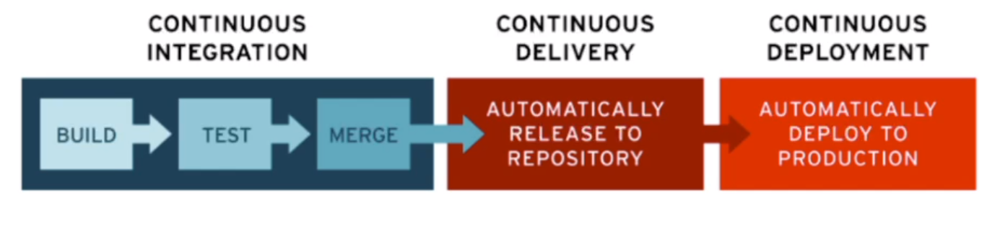

# CI - CD

## Group Programming
- Larger groups sizes Call for an increased amount of structure. Too little structure in a large team results in chaos. Too much structure in a small team hampers productivity.

    Your developer habits need to be tweaked to work in a team setting. More communication, less YOLO.

        "If you can't feed a team with two pizzas, it's too large"
                                    Jeff Bezos, CEO, Amazon.

## Continuous Integration:


- Automatically run piplines on new code changes to check for issues or bugs.
- Fast feedback loop for developers
- Shared rules which lead to better code quality
- Promotes transparency and knowledge sharing.

        The most important part with CI is that it promotes transparency and knowledge sharing. All code gets tested before intergration. 
        This reduces critical errors and reduces human testers and human error.

## CI CD in Practice.
1. Develop code changes.  

2. Commit and push code to Github.
3. Github automatically detect new code and starts CI on a server which installs the project
4. CI tests the code and alerts the developer if there are any errors.
5. Developer fixes problem and starts CI again.

### CI CD can also do other things.
- Train and test the ML model
- Create reports and share them with stakeholders.
- Ask ChatGPT for code improvments.

What *should* CI/CD do?  

        It depends on the project situation. CI will run often, so you don't want it to be expensive (OpenAI API) or run very slowly (Train a big ML model).
**It is also very important that what you run on the cloud is fast to conserve productivity and flow**    

        If something runs very slowly, it is usually done during the night

What will we do in the project.
- Download code from github
- Install our python requirements into our venv
- Check our code for style/format errors.
- Run tests.
- (anything else you want to try for fun). :thinking:

GitHub reads the config file  
  
  We can configure
  - When the workflow runs. Every git push. Every sunday.
  - What OS should be used (Mac, Windows, ...)
  - What Python version we should use. We can even repeat the same workflow with different Python versions.
  ### Example of yaml code.
```yaml
name: Python run CI CD
on: pull_request
jobs:
 run_ci_cd_pipeline:
    runs-on: ubuntu-latest
    steps:
    # Git clone Repo
    - name: Checkout Git Repo
      uses: actions/checkout@v3

    # Install Python
    - name: Set up Python 3.10
      uses: actions/setup-python@v4
      with:
        python-version: '3.10'

    # Install requirements
    - name: Install dependencies
      run: |
        pip install -r requirements.txt

    # Run tests
    - name: Test with pytest
      run: |
        pytest tests/
``` 

    

